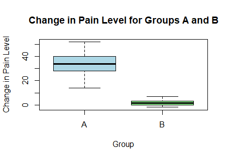

# Statistical Inference: Parametric Tests on Pain Reduction

## Project Overview
This project presents a statistical analysis conducted in R using data from a randomized controlled trial.  
The objective is to evaluate changes in pain levels before and after treatment and to compare the effectiveness of a test drug versus placebo.

## Objective
To assess whether the test drug leads to a statistically significant reduction in pain compared to placebo using parametric statistical methods.

## Dataset
The dataset (`vas_data.csv`) is included in the repository and located in the root directory.

The dataset contains observations from **32 patients** randomly assigned to two groups:
- **Group A** — test drug  
- **Group B** — placebo  

Key variables:
- `VAS_before` — pain level before treatment (Visual Analogue Scale)
- `VAS_after` — pain level after 3 days of treatment

## Analysis Workflow
1. Data import and structure inspection  
2. Normality assessment (graphical methods and statistical tests)  
3. Paired t-tests within each group  
4. Comparison of mean pain reduction between groups  
5. Visualization of pain reduction using boxplots  

## Methods and Techniques
- Normality checks:
  - QQ plots
  - Boxplots
  - Shapiro–Wilk test
  - Lilliefors (Kolmogorov–Smirnov) test
- Statistical tests:
  - Paired t-test
  - Two-sample t-test
- Data visualization

## Key Findings
- Both groups showed a reduction in pain after treatment  
- The mean reduction in pain was **significantly greater in Group A** compared to Group B

  ## Visualization

## Tools and Skills
- R
- Statistical inference
- Hypothesis testing
- Data visualization

## How to Run the Project
1. Clone the repository
2. Open the R script in R or RStudio
3. The dataset (`vas_data.csv`) is already included in the repository
4. Run the script sequentially

## Notes
This project was completed for educational purposes and demonstrates the application of parametric statistical tests in R.
